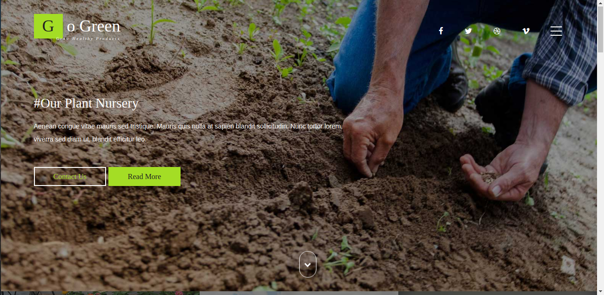
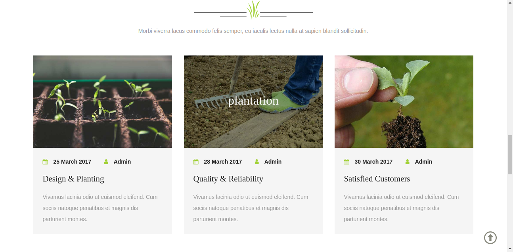
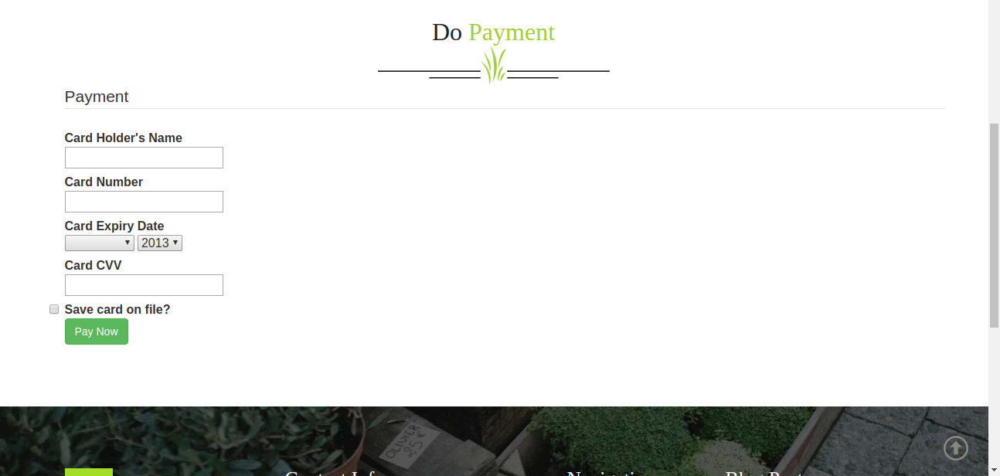

# Go Green

Efficiently manage seedlings with minimal care, cost, and maintenance in a compact nursery area. Optimize growing conditions for plants easily and reduce seed requirements compared to direct sowing, thanks to better management practices.

## Web Application for Buying Nursery Plants

Experience seamless backend connectivity with our web application designed to help you purchase nursery plants effortlessly.

### Features

- User-friendly interface
- Efficient plant management
- Cost-effective solutions
- Easy manipulation of growing conditions
2
### Gallery

Take a look at our application in action:

Join us in making plant management easier and more efficient with Go Green!
